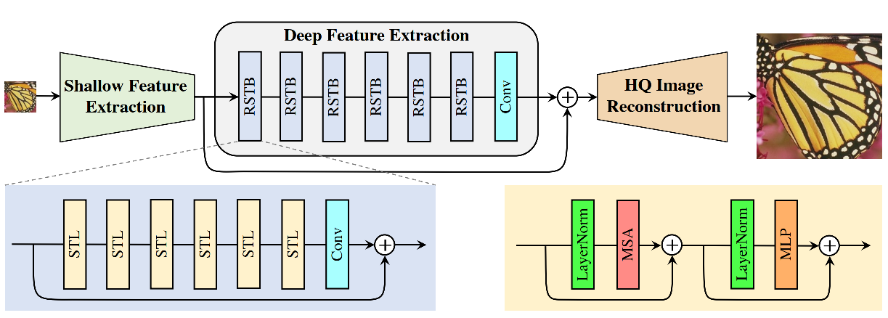

# SwinIR 论文复现

SwinIR: Image Restoration Using Swin Transformer

官方源码：https://github.com/JingyunLiang/SwinIR

复现地址：https://github.com/sldyns/SwinIR_paddle

脚本任务：https://aistudio.baidu.com/aistudio/clusterprojectdetail/3792518

## 1. 简介



SwinIR的结构比较简单，如果看过Swin-Transformer的话就没什么难点了。作者引入Swin-T结构应用于低级视觉任务，包括图像超分辨率重建、图像去噪、图像压缩伪影去除。SwinIR网络由一个浅层特征提取模块、深层特征提取模块、重建模块构成。重建模块对不同的任务使用不同的结构。浅层特征提取就是一个3×3的卷积层。深层特征提取是k个RSTB块和一个卷积层加残差连接构成。每个RSTB（Res-Swin-Transformer-Block）由L个STL和一层卷积加残差连接构成。

## 2. 复现精度

在 CBSD68 测试集上测试，达到验收最低标准34.32：

| DnCNN-B | Noise Level15 |
| ------- | ------------- |
| Pytorch | 34.42         |
| Paddle  | 34.33         |

注：源代码八卡训练的iteration为 1,600,000，我们四卡只训练到了 426,000 就超时停止了.

## 3. 数据集、预训练模型、文件结构

### 训练数据

[DIV2K](https://cv.snu.ac.kr/research/EDSR/DIV2K.tar) (800 training images) + [Flickr2K](https://cv.snu.ac.kr/research/EDSR/Flickr2K.tar) (2650 images) + [BSD500](http://www.eecs.berkeley.edu/Research/Projects/CS/vision/grouping/BSR/BSR_bsds500.tgz) (400 training&testing images) + [WED](http://ivc.uwaterloo.ca/database/WaterlooExploration/exploration_database_and_code.rar)(4744 images)

已经整理好的数据：放在了 [Ai Studio](https://aistudio.baidu.com/aistudio/datasetdetail/149405) 里.

训练数据放在：`trainsets/trainH` 下

### 测试数据

测试数据为 CBSD68：放在了 [Ai Studio](https://aistudio.baidu.com/aistudio/datasetdetail/147756) 里.

解压到：`testsets/CBSD68`

### 预训练模型

百度网盘：[下载链接](https://pan.baidu.com/s/1fHukMTWmgFcxcc7Gau1tEQ)，提取码：2108，下好后放在文件夹 `pretrained_models` 下：

1. 官方预训练模型，已转为 paddle 的，名为 `005_colorDN_DFWB_s128w8_SwinIR-M_noise15.pdparams`.
2. 复现的模型，名为 `SwinIR_paddle.pdparams`.

### 文件结构

```
SwinIR_Paddle
    |-- data                       # 数据相关文件
    |-- models                     # 模型相关文件
    |-- options                    # 训练配置文件
    |-- trainsets
         |-- trainH                # 训练数据
    |-- testsets
         |-- CBSD68                # 测试数据
    |-- test_tipc                  # TIPC: Linux GPU/CPU 基础训练推理测试
    |-- pretrained_models          # 预训练模型
    |-- utils                      # 一些工具代码
    |-- config.py                  # 配置文件
    |-- generate_patches_SIDD.py   # 生成数据patch
    |-- infer.py                   # 模型推理代码
    |-- LICENSE                    # LICENSE文件
    |-- main_test_swinir.py        # 模型测试代码
    |-- main_train_psnr.py         # 模型训练代码
    |-- main_train_tipc.py         # TICP训练代码
    |-- README.md                  # README.md文件
```

## 4. 环境依赖

PaddlePaddle >= 2.3.2

## 5. 快速开始

```shell
# 单机四卡
python -m paddle.distributed.launch main_train_psnr.py --opt options/train_swinir_multi_card_32.json
```

训练过程会将模型参数保存在 `./denoising/swinir_denoising_color_15/models/` 文件夹下.

训练日志将会保存在 `./denoising/swinir_denoising_color_15/models/train.log`.

### 模型评估与预测

在 CBSD68 测试数据上作测试，加强度为15的噪声，结果将存放在 `results/swinir_color_dn_noise15/` 文件夹下

```shell
python main_test_swinir.py --task color_dn --noise 15 --model_path pretrained_models/SwinIR_paddle.pdparams --folder_gt testsets/CBSD68/
```

输出如下：

```shell
-- Average PSNR/SSIM(RGB): 34.33 dB; 0.9345
```

接近了验收精度. 

### 推理过程：

需要安装 reprod_log：

```
pip install reprod_log
```

模型动转静导出：

```shell
python export_model.py --model_path pretrained_models/SwinIR_paddle.pdparams --save-inference-dir output/
```

最终在`output/`文件夹下会生成下面的3个文件：

```
output
  |----model.pdiparams     : 模型参数文件
  |----model.pdmodel       : 模型结构文件
  |----model.pdiparams.info: 模型参数信息文件
```

注：导出设置的是固定输入大小，否则会报错.

模型推理：

```
python infer.py --model-dir output/ --folder_gt ./testsets/CBSD68
```

注：由于导出设置的是固定输入大小，因此是用滑窗预测，故精度有所损失.

## 6. TIPC

首先安装AutoLog（规范化日志输出工具）

```
pip install  https://paddleocr.bj.bcebos.com/libs/auto_log-1.2.0-py3-none-any.whl
```

在linux下，进入 SwinIR_paddle 文件夹，运行命令：

```shell
bash test_tipc/prepare.sh ./test_tipc/configs/SwinIR/train_infer_python.txt 'lite_train_lite_infer'

bash test_tipc/test_train_inference_python.sh ./test_tipc/configs/SwinIR/train_infer_python.txt 'lite_train_lite_infer'
```

## 7. LICENSE

本项目的发布受[Apache 2.0 license](https://github.com/PaddlePaddle/models/blob/release/2.2/community/repo_template/LICENSE)许可认证

